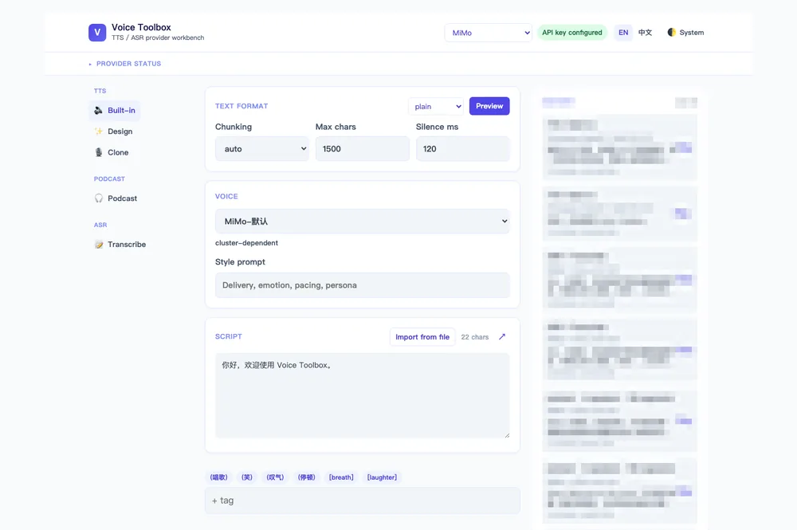
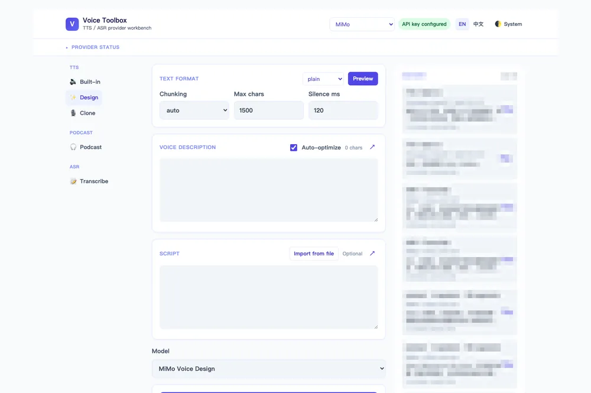
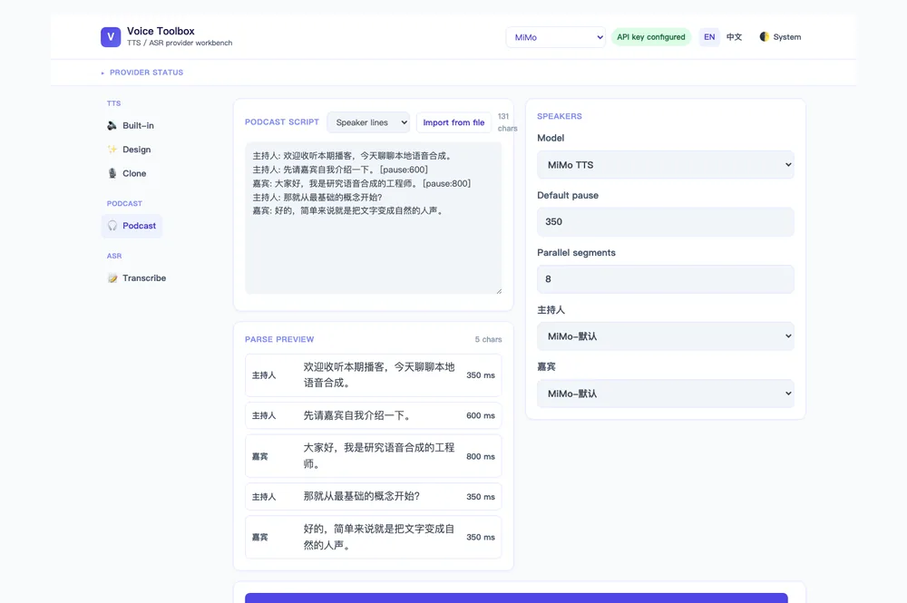
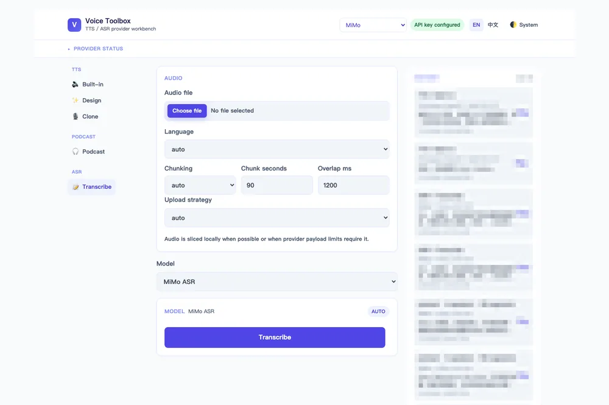

# voice-toolbox

本地优先的语音工具箱 — MiMo、Fish Audio、OpenRouter、Volcengine 及本地 MLX Audio 共享同一 Python 核心、Typer CLI、FastAPI API 和 React 前端。

Local-first TTS & ASR toolbox — MiMo, Fish Audio, OpenRouter, Volcengine, and local MLX Audio share one Python core, Typer CLI, FastAPI API, and React web UI.



## 功能 | Features

- **多供应商 | Multi-provider**: MiMo、Fish Audio、OpenRouter、Volcengine、本地 MLX Audio（Apple Silicon）
- **TTS**: 内置合成、声音设计、声音克隆、长文本分块、Markdown 清洗
- **ASR**: 后端音频分块、浏览器分块会话、转录下载（txt/srt/vtt/json）
- **播客 | Podcast**: 多说话人脚本 → 单音频文件，支持队列任务和并行合成
- **制品 | Artifacts**: 本地优先存储，含 `.podcast.json` 清单、脱敏附属文件、格式转换
- **隐私 | Privacy**: API 密钥仅存 `.env`／环境变量；原始文本/音频/base64 绝不写入附属元数据

## 目录 | Table of Contents

- [快速开始 | Quick Start](#快速开始--quick-start)
- [Web UI 使用指南 | Web UI Guide](#web-ui-使用指南--web-ui-guide)
- [供应商 | Providers](#供应商--providers)
- [CLI 示例 | CLI Examples](#cli-示例--cli-examples)
- [API 端点 | API Endpoints](#api-端点--api-endpoints)
- [播客生成 | Podcast Generation](#播客生成--podcast-generation)
- [文档 | Documentation](#文档--documentation)
- [开发 | Development](#开发--development)
- [许可证 | License](#许可证--license)

## 快速开始 | Quick Start

**环境要求 | Requirements**: Python 3.11+、[uv](https://docs.astral.sh/uv/)、[bun](https://bun.sh)、系统安装 `ffmpeg`。

```bash
# 1. 安装依赖 | Install dependencies
uv sync --extra dev
bun install --cwd apps/web

# 2. 配置供应商 | Configure providers
cp -n .env.example .env
cp -n voice_toolbox.toml.example voice_toolbox.toml

# 3. 编辑 .env，填入 API 密钥 | Edit .env — add your API keys
#    MIMO_API_KEY、FISH_AUDIO_API_KEY、OPENROUTER_API_KEY、VOLCENGINE_SPEECH_API_KEY

# 4. 在 voice_toolbox.toml 中取消注释供应商配置块
#    Uncomment provider blocks in voice_toolbox.toml
#    详见 docs/providers/ 中各供应商的配置示例

# 5. 启动后端 + 前端 | Start backend + frontend
make backend-server &    # API 监听 127.0.0.1:8000
make frontend-server     # Web UI 监听 127.0.0.1:5173
```

Python 3.13+ 用户：`audioop-lts` 自动安装（标准库 `audioop` 已移除）。

## Web UI 使用指南 | Web UI Guide

启动后浏览器打开 `http://127.0.0.1:5173`。整个界面分三块：**顶栏**（供应商/语言/主题）、**左侧导航**（选功能）、**主工作区 + 右侧输出/历史面板**。

Start the servers and open `http://127.0.0.1:5173`. The layout: **topbar** (provider / language / theme), **left sidebar** (pick a function), **main workspace + right output & history panel**.

### 顶栏与导航 | Topbar & navigation

- **提供方 Provider** 下拉：切换供应商。切换会清空当前结果与历史预览（历史数据不丢，只是不再回填到工作区）。
- **密钥状态徽章**：显示 `API 密钥已配置` / `API 密钥缺失` / `本地提供方`（MLX Audio 无需密钥）。缺失时下方连接详情会自动展开，提示该填哪个环境变量。
- **语言** `EN` / `中文`、**主题** 浅色/深色/跟随系统。
- **左侧导航**三个分区：TTS（内置/设计/克隆三个子模式）、Podcast、ASR（转录）。按钮在当前供应商不支持该能力时会置灰。

### TTS — 文本转语音 | Text to speech

TTS 有三个子模式，在左侧导航点切换。所有模式共享顶部「文本格式」（plain / markdown / auto）与「分段」控制；点「预览」可查看 Markdown 清洗后的效果（调 `/v1/normalize/text`）。


<details>
<summary><b>内置模式 Built-in</b>（最常用：选音色 → 输入文本 → 生成）</summary>

1. 左侧导航点 🔊 **Built-in**。
2. **音色 Voice**：下拉选一个内置音色（如「冰糖」）。
3. **风格提示 Style prompt**（可选）：自然语言描述演绎方式，如"温柔、慢速、播报腔"。
4. **脚本 Script**：输入要合成的文本，或点「从文件导入」读 `.txt`/`.md`。文本框旁的标签 chip（`(笑)` `(停顿)` `[laughter]` 等）点击即插入到光标处。
5. 点 **生成语音**。结果出现在右侧：内嵌播放器 + 「下载格式」下拉（源格式/WAV/MP3/PCM/M4A/AAC/FLAC/OGG/WEBM）+ 下载链接。

</details>

<details>
<summary><b>设计模式 Design</b>（用文字描述造一个新音色）</summary>



1. 左侧导航点 ✨ **Design**。
2. **音色描述 Voice description**：用自然语言描写音色特征——音质、年龄、口音、能量、语速、场景。例如"年轻女性，清亮，中等语速，适合有声书"。
3. **自动优化 Auto-optimize**（默认开）：开启时下方脚本变可选；关闭则脚本必填，用于精确控制试听文本。
4. 点 **生成语音**。该模式没有音色下拉——音色由描述生成。

</details>

<details>
<summary><b>克隆模式 Clone</b>（用一段参考音频复刻音色）</summary>


1. 左侧导航点 🎙️ **Clone**。
2. **克隆样本 Clone sample**：上传一段参考音频（wav/mp3/flac/m4a 等）。界面会显示预估的 Base64 大小，超过 10 MiB 会报错并禁用提交。
3. **样本转录 Sample transcript**（可选）：样本对应的文字。Fish Audio 直接克隆时必填。
4. **脚本 Script**：要合成的文本（必填）。
5. **风格与授权**：可选的风格提示 + **必勾**的授权确认（"我有权使用该声音样本进行合成"）。
6. 点 **生成语音**。

</details>

### 播客 — 多说话人合成 | Podcast



左侧填脚本、看解析预览；右侧给每个说话人配音色、调参数。

1. 左侧导航点 🎧 **Podcast**。
2. **播客脚本 Podcast script**：输入脚本（格式见[下文](#脚本格式--script-formats)），或「从文件导入」。旁边的 **脚本格式** 下拉可强制指定（默认 Auto 自动识别）。
3. **解析预览 Parse preview**：实时显示解析出的段落数、每段说话人/文本/停顿（ms）。有语法错误会在此红色提示（带行号）。
4. 右侧 **说话人 Speakers** 卡：
   - **模型 Model**：选一个支持 `tts.builtin` 的模型。
   - **默认停顿 Default pause**（ms，默认 350）、**并行片段数 Parallel segments**（1–16，默认 8）。
   - **说话人 → 音色**：解析出的每个说话人都会有一个下拉，**必须为每个说话人选音色**，否则提示"请为每个说话人选择音色"且禁用提交。
5. 点 **生成播客**。生成中显示进度（`当前/总 · 说话人`）和已用/预计剩余时间，可随时 **取消**。完成后右侧出现播放器和下载。

### ASR — 语音转文字 | Speech to text



1. 左侧导航点 📝 **Transcribe**。
2. **音频文件 Audio file**：上传 wav/mp3/flac/m4a 等。
3. **语言 Language**：`auto` 自动识别，或指定 zh/en/粤语/日语/韩语 等（视供应商支持而定）。
4. **分段 Chunking**：off / auto / force。长音频建议 auto 或 force，配「分段秒数」（默认 90）和「重叠毫秒」（默认 1200）。
5. **上传策略 Upload strategy**：
   - `auto`（默认）：需要时本地切片。
   - `优先浏览器分片`：本地切片逐段上传，不支持的编码先试 ffmpeg wasm 再回退后端。
   - `后端上传`：整文件上传，服务端分段。
6. **时间戳 / 说话人**（仅模型支持时出现）：勾选后可下载带时间戳或说话人标注的转录。
7. 点 **转录**。结果区显示纯文本预览，支持复制，以及「下载格式」TXT / SRT / VTT（需时间戳）/ JSON。

### 历史与复用 | History & reuse

右侧 **历史** 面板列出最近 20 条制品（TTS/ASR/播客）。每条显示类型、供应商·模型、预览片段、时间。点 **播放**（音频）或 **查看**（转录）会把该制品回填到对应工作区并切过去——例如点一条克隆 TTS 的历史，会自动切到克隆模式并加载结果，方便对照重做。

## 供应商 | Providers

| 供应商 Provider | TTS 内置 | 声音设计 | 声音克隆 | ASR | 备注 Notes |
|---|---|---|---|---|---|
| [MiMo](docs/providers/mimo.md) | ✓ | ✓ | ✓ | ✓ | 默认供应商；v2.5 模型 |
| [Fish Audio](docs/providers/fish-audio.md) | ✓ | ✓ | ✓ | ✓ | 通过 MessagePack 引用直接克隆 |
| [OpenRouter](docs/providers/openrouter.md) | ✓ | — | — | ✓ | OpenAI 兼容端点；MP3 输出 |
| [Volcengine](docs/providers/volcengine.md) | ✓ | — | — | ✓ | 豆包 Seed TTS/ASR；Agent Plan 语音 |
| [MLX Audio](docs/providers/mlx-audio.md) | ✓ | — | ✓ | ✓ | Apple Silicon 纯本地 |

完整配置参考见 [docs/configuration.md](docs/configuration.md)。各供应商配置见 [docs/providers/](docs/providers/)。

See [docs/configuration.md](docs/configuration.md) for full config reference. Per-provider setup in [docs/providers/](docs/providers/).

## CLI 示例 | CLI Examples

```bash
# 内置 TTS | Built-in TTS
uv run --env-file .env voice-toolbox tts synthesize \
  --text "你好，欢迎使用 MiMo 语音合成。" \
  --voice 冰糖 --format wav

# 从文件 TTS（纯文本，自动分块） | TTS from file (plain text, auto-chunked)
uv run --env-file .env voice-toolbox tts synthesize \
  --file smoke-inputs/tts-long.txt --text-format plain \
  --voice 冰糖 --chunking auto --format wav

# 从 Markdown TTS | TTS from Markdown
uv run --env-file .env voice-toolbox tts synthesize \
  --file smoke-inputs/tts-long.md --text-format markdown \
  --voice 冰糖 --chunking auto --format wav

# ASR | ASR
uv run --env-file .env voice-toolbox asr transcribe \
  --file smoke-inputs/asr-short.wav --language auto

# 后端 ASR 分块（长音频） | Backend ASR chunking (long audio)
uv run --env-file .env voice-toolbox asr transcribe \
  --file smoke-inputs/asr-long.wav --language auto \
  --chunking force --chunk-seconds 90 --chunk-overlap-ms 1200
```

格式支持：MiMo 和 Fish Audio → `wav`；OpenRouter → `mp3`。API 下载格式转换：`/v1/artifacts/{id}/download?format=wav|mp3|pcm|m4a|aac|flac|ogg|webm`。

Format support: MiMo & Fish Audio → `wav`; OpenRouter → `mp3`. API download conversion at `/v1/artifacts/{id}/download?format=wav|mp3|pcm|m4a|aac|flac|ogg|webm`.

## API 端点 | API Endpoints

| 方法 Method | 路径 Path | 说明 Description |
|---|---|---|
| `GET` | `/v1/providers` | 供应商注册表、模型、语音、选项 schema |
| `POST` | `/v1/tts/synthesize` | TTS 合成（multipart: `text_file` + `provider_options`） |
| `POST` | `/v1/asr/transcribe` | 后端 ASR（multipart: `audio_file`） |
| `POST` | `/v1/asr/chunk-sessions` | 创建浏览器分块会话 |
| `POST` | `/v1/asr/chunk-sessions/{id}/chunks` | 上传分块 |
| `POST` | `/v1/asr/chunk-sessions/{id}/finish` | 完成并转录 |
| `POST` | `/v1/normalize/text` | 预览 Markdown 清洗结果 |
| `GET` | `/v1/artifacts/{id}/download` | 下载音频（支持格式转换） |
| `GET` | `/v1/artifacts/{id}/transcript` | 下载转录（txt/srt/vtt/json） |
| `POST` | `/v1/podcast/jobs` | 发起播客任务（multipart） |
| `GET` | `/v1/podcast/jobs/{id}` | 查询任务状态 |
| `DELETE` | `/v1/podcast/jobs/{id}` | 取消任务 |

## 播客生成 | Podcast Generation


多说话人脚本 → 单音频文件。将每个说话人映射到同一 TTS 供应商/模型的内置语音，投递任务并轮询完成。服务端最多 8 个并发任务；单任务内，远程分段并行合成（1–16 worker，默认 8），再按脚本顺序合并。MLX Audio 串行合成，避免 Metal/GPU 争用。

Multi-speaker scripts → single audio file. Map speakers to built-in voices from one TTS provider/model, queue a job, and poll for completion. Server runs up to 8 concurrent jobs; within a job, remote segments synthesize in parallel (1–16 workers, default 8), then merge in script order. MLX Audio synthesis runs serial to avoid Metal/GPU contention.

### 脚本格式 | Script formats

`script_format` 省略时默认 `auto`，按下面顺序自动识别：以 `{`/`[` 开头 → JSON；含 `#`/`##`/`###` 标题 → Markdown；含 `lines:` 键 → YAML；否则 → 说话人文本行。

<details>
<summary><b>说话人文本行 | Speaker-colon</b>（最简单，推荐手写）</summary>

每行 `说话人名: 文本`，分隔符是**英文冒号 `:`**（中文全角 `：` 会报错）。空行跳过。`[pause:N]` 只能出现在行尾或独占一行，单位毫秒，调整该段之后的停顿。最后一段的停顿会被忽略。

```
主持人: 欢迎收听本期播客，今天我们来聊聊本地大模型。
主持人: 先做个简单的自我介绍吧。 [pause:600]
嘉宾: 大家好，我是研究语音合成的工程师。 [pause:800]
主持人: 那就从最基础的概念开始？
[pause:400]
嘉宾: 好的。简单来说，就是把文字变成听起来自然的人声。
```

</details>

<details>
<summary><b>Markdown 标题</b>（适合从笔记复制）</summary>

`#`/`##`/`###`（1–3 个）都等价于"切说话人"——没有层级嵌套，都只是说话人切换。标题名即说话人，该说话人持续生效直到下一个标题。空行分段：标题下连续多行会拼成一段；遇空行则另起一段（同一说话人）。第一段文本前必须有标题，否则报错。

```
## 主持人
欢迎收听本期播客，今天我们来聊聊本地大模型。

先做个简单的自我介绍吧。

## 嘉宾
大家好，我是研究语音合成的工程师。

## 主持人
那就从最基础的概念开始？

## 嘉宾
好的。简单来说，就是把文字变成听起来自然的人声。
```

</details>

<details>
<summary><b>JSON / YAML</b>（程序生成，适合大模型产出）</summary>

顶层必须是 `{"lines": [...]}`（YAML 同理）。每个 item 需 `speaker` 与 `text`；可选 `pause_after_ms`（非负整数，毫秒）。顶层若有 `speakers` 块会被**忽略**——说话人完全由 `lines[].speaker` 决定。

```yaml
lines:
  - speaker: 主持人
    text: 欢迎收听本期播客，今天我们来聊聊本地大模型。
    pause_after_ms: 350
  - speaker: 主持人
    text: 先做个简单的自我介绍吧。
    pause_after_ms: 600
  - speaker: 嘉宾
    text: 大家好，我是研究语音合成的工程师。
    pause_after_ms: 800
  - speaker: 主持人
    text: 那就从最基础的概念开始？
    pause_after_ms: 400
  - speaker: 嘉宾
    text: 好的。简单来说，就是把文字变成听起来自然的人声。
```

```json
{"lines":[
  {"speaker":"主持人","text":"欢迎收听本期播客。"},
  {"speaker":"嘉宾","text":"大家好，我是研究语音合成的工程师。","pause_after_ms":800}
]}
```

</details>

### 用大模型生成脚本 | Generating scripts with an LLM

想让 GPT/Claude 等帮你写播客脚本？把下面这段 instruction 贴进 prompt，模型就会按本工具能直接解析的 YAML 格式输出。把"主题/说话人/时长"换成你的需求即可。

<details>
<summary><b>LLM 提示词模板（复制即用）</b></summary>

```text
你是播客脚本撰写人。请根据下方"主题"，为两位说话人生成一段自然、口语化的中文播客脚本，目标时长约 5 分钟。

说话人：
- 主持人：引导话题、提问、总结
- 嘉宾：回答问题、给出具体例子

输出要求（严格遵守，否则下游解析会失败）：
1. 只输出 YAML，不要任何解释、前后缀、``` 代码围栏。
2. 顶层为一个对象，含唯一的键 lines，其值为 segment 列表。
3. 每个 segment 恰好包含三个字段：
   - speaker：说话人名（只能是"主持人"或"嘉宾"）
   - text：该说话人要说的话，中文，口语化，单段不超过 3 句。
   - pause_after_ms：说完后的停顿，整数毫秒。常用值：
     句末陈述 350，句尾强调 600–800，话题切换 800–1200。
     每段都必须给出该字段，最后一段也写 350。
4. 单段 text 控制在 80 字以内；全文 lines 数量在 30–60 段之间。
5. 不要出现 [pause:] 这类标记，停顿一律用 pause_after_ms 表达。
6. 不要输出 YAML 以外的任何内容（不要 speakers 块、不要注释）。

主题：本地大模型在语音合成中的应用
```

</details>

### 发起任务 | Submitting a job

<details>
<summary><b>curl 示例（含说话人→声音映射）</b></summary>

播客只走 API（CLI 暂不支持）。`speaker_voices` 是 JSON 对象，把每个说话人名映射到所选供应商/模型下的内置语音 id。**每个说话人都必须映射**，否则 422。非 ASCII 说话人名（如"主持人"）请用名字作 key（不要用 slug id，会冲突）。

```bash
# 1. 查可用语音 id
curl -s 127.0.0.1:8000/v1/providers | jq '.providers.mimo.models[].voices[] | {id,name}'

# 2. 投递播客任务
curl -s -X POST 127.0.0.1:8000/v1/podcast/jobs \
  -F 'provider_id=mimo' \
  -F 'script_format=speaker_colon' \
  -F 'default_pause_ms=350' \
  -F 'segment_workers=8' \
  -F 'speaker_voices={"主持人":"<voice-id-host>","嘉宾":"<voice-id-guest>"}' \
  -F 'script=主持人: 欢迎收听本期播客。
嘉宾: 大家好。
主持人: 我们开始吧。'
# → {"job_id":"...", "status":"queued", "total_segments":3}

# 3. 轮询状态
curl -s 127.0.0.1:8000/v1/podcast/jobs/<job_id>
# status: queued → running → completed (completed 后从 artifacts 接口下载 wav)
```

</details>

### 规则与限制 | Rules & limits

- 分隔符是英文冒号 `:`；`[pause:N]` 是整数毫秒（不是 `500ms`），只能行尾或独占一行，不能出现在句子中间。
- 上限：200 段 / 200,000 字符；单段停顿 ≤ 60,000 ms；累计停顿 ≤ 1 小时；默认停顿 ≤ 60,000 ms。最后一段的停顿不生效。
- JSON/YAML 的顶层 `speakers` 块会被忽略；说话人完全由 `lines[].speaker` 决定。
- 产物含 `.podcast.json` 清单（说话人、voice id、每段起止时间、总时长），与音频一同存入 artifacts。

## 文档 | Documentation

| 文档 | 内容 |
|---|---|
| [配置 Configuration](docs/configuration.md) | `.env`、`voice_toolbox.toml`、发现顺序、分块、日志 |
| [MiMo](docs/providers/mimo.md) | 默认供应商、模型、Token Plan URL |
| [Fish Audio](docs/providers/fish-audio.md) | 模型、声音设计、直接克隆、引用语音 |
| [OpenRouter](docs/providers/openrouter.md) | OpenAI 兼容 TTS/ASR、instructions 选项 |
| [Volcengine](docs/providers/volcengine.md) | 豆包 Seed TTS/ASR、Agent Plan 语音 |
| [MLX Audio](docs/providers/mlx-audio.md) | Apple Silicon 本地模型、语音、依赖 |

冒烟测试指南 Smoke test guides: [MiMo](docs/smoke/mimo.md)、[Fish Audio](docs/smoke/fish-audio.md)、[OpenRouter](docs/smoke/openrouter.md)、[Volcengine](docs/smoke/volcengine.md)、[MLX Audio](docs/smoke/mlx-audio.md)。

## 开发 | Development

```bash
make test           # 后端 + 前端测试 | backend + frontend tests
make check          # 测试 + lint + 类型检查 + 前端构建
make backend-server # 启动 FastAPI
make frontend-server # 启动 Vite 开发服务器
```

`make check` 运行：`ruff`、`ty`、后端测试、前端 lint/format/test 及 web 构建。

## 许可证 | License

MIT © 2026 DengQi
